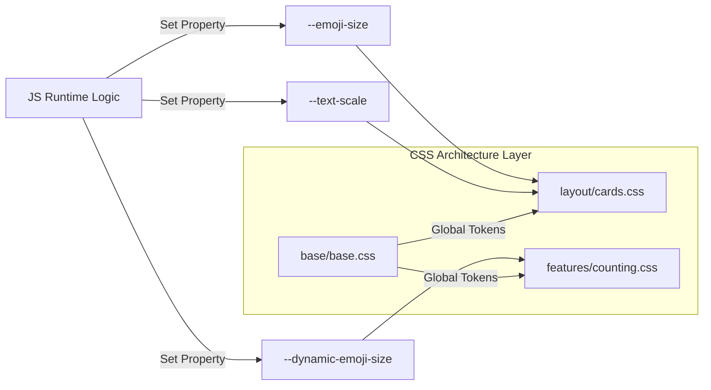

# 🎨 CSS ARCHITECTURE (v16.2)

- **ID**: `01.02`
- **Version**: `v16.2`
- **Primary Source**: `css/main.css`
- **Depends On**: `[01.00_PROJECT_INDEX.md]`
- **Keywords**: #CSS #Styles #Themes #Layout #Animations

---

## 🏗️ MODULAR ARCHITECTURE
The project uses a CSS import system managed by `main.css`.

| Folder | File | Purpose |
|:---|:---|:---|
| `base/` | `base.css` | Global fonts, variables (`:root`), resets |
| `base/` | `animations.css` | Keyframes & shared animations |
| `layout/` | `navbar.css` | Top bar, branding, dropdowns |
| `layout/` | `overlay.css` | Welcome screen & category overlays |
| `layout/` | `cards.css` | 3D flashcard system & layouts |
| `features/` | `navigation.css` | Nav buttons, progress bars |
| `features/` | `counting.css` | Counting & fitscreen special rules |
| `themes/` | `kids.css` | Category card themes & gradients |

---

## 🏗️ CSS VARIABLE DEPENDENCY MAP

---

## 🎨 DESIGN SYSTEM (`base.css`)
- **Typography**: Outfit, Hind, Bubblegum Sans.
- **Color Palette**:
  - `--primary-pink`, `--soft-blue`, `--vibrant-orange`, `--soft-green`.
- **Layout Variables**:
  - `--nav-height`, `--border-radius-lg`.

---

## ✨ ANIMATIONS & INTERACTION
- **Visual Feedback**:
  - `.emoji-animate`: `playful-bounce`
  - `.start-orb:hover`: `rocket-launch`
  - `.baby-icon`: `happy-wiggle`
- **JS-Driven Styles**:
  - `.active-menu-icon`: Navbar highlighting.
  - `.playing`: Audio progress visibility.
  - `.is-flipped`: 3D card state.

---
#CSS #Layout #Styles #DesignSystem #WebDesign
