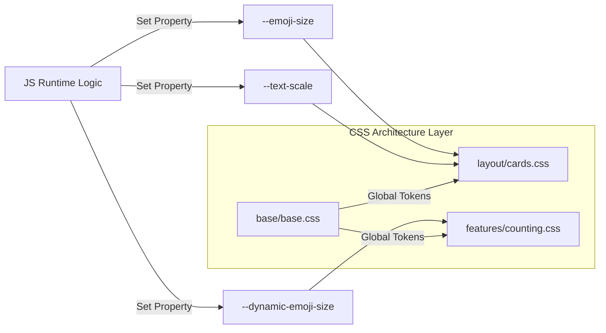

# 🎨 CSS ARCHITECTURE (v17.2)

- **ID**: `01.02`
- **Version**: `v17.2`
- **Primary Source**: `frontend/src/css/`
- **Depends On**: `[01.00_PROJECT_INDEX.md]`
- **Keywords**: #CSS #Styles #Themes #Layout #Frontend #v17.2

---

## 🏗️ MODULAR ARCHITECTURE
The project uses a clean modular CSS system under `frontend/src/css/`, managed by a root `main.css` loader.

| Domain | File Path | Purpose |
|:---|:---|:---|
| **Base** | `base/base.css` | Global fonts, variables (`:root`), resets |
| **Base** | `base/animations.css` | Keyframes & shared animations |
| **Layout** | `layout/navbar.css` | Top bar, branding, dropdowns |
| **Layout** | `layout/overlay.css` | Welcome screen & category overlays |
| **Layout** | `layout/cards.css` | 3D flashcard system & layouts |
| **Features** | `features/navigation.css` | Nav buttons, progress bars |
| **Features** | `features/counting.css` | Counting & fitscreen special rules |
| **Themes** | `themes/kids.css` | Category card themes & gradients |
| **Audit** | `06 Internal Audit/` | specialized v2.0 styles (Oversight Hub) |
| **Settings** | `frontend/public/settings/settings.css` | Premium modular settings styling |

---

## 🏗️ CSS VARIABLE DEPENDENCY MAP (v17.2)

---

## 🎨 DESIGN SYSTEM (`base.css`)
- **Typography**: Outfit, Hind, Bubblegum Sans.
- **Color Palette**:
  - `--primary-pink`, `--soft-blue`, `--vibrant-orange`, `--soft-green`.
- **Layout Tokens**:
  - `--nav-height` (95px), `--border-radius-lg`.

---

## ✨ ANIMATIONS & INTERACTION
- **Visual Feedback**:
  - `.emoji-animate`: `playful-bounce`
  - `.start-orb:hover`: `rocket-launch`
  - `.logo-wiggle`: Branding animation.
- **JS-Driven Classes**:
  - `.active-menu-icon`: Top Nav highlighting.
  - `.playing`: Real-time audio progress visibility.
  - `.is-flipped`: 3D card state toggle.

---
#CSS #Layout #Styles #DesignSystem #WebDesign #v17.2

