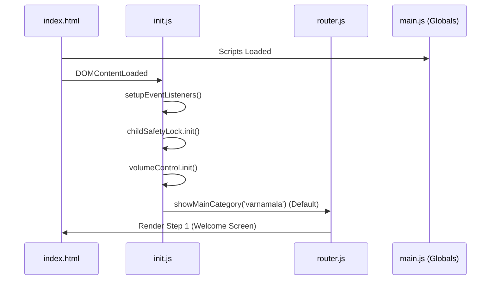

# ⚙️ JAVASCRIPT ARCHITECTURE (v17.2)

- **ID**: `01.03`
- **Version**: `v17.2`
- **Primary Source**: `frontend/src/js/`
- **Depends On**: `[01.00_PROJECT_INDEX.md]`, `[01.14_GLOBAL_REGISTRY.md]`
- **Keywords**: #JavaScript #Logic #Modules #State #Frontend #v17.2

---

## 🧠 CORE LOGIC MODULES

| Module | Purpose | Key Responsibilities |
|:---|:---|:---|
| `core/main.js` | Globals | Manages high-level state variables and configurations. |
| `core/init.js` | Bootloader | Initializes events, volume, and safety locks on DOM load. |
| `navigation/router.js`| Router | Handles the 5-step overlay transitions and category changes. |
| `ui/display.js` | Rendering | Injects HTML cards and SVG icons into the master container. |
| `utils/helpers.js` | Utilities | Shared functions for audio playback, flipping, and timing. |
| `utils/child-safety.js`| Safety | Parental Gate, interaction locking, and navigation protocols. |
| `06 Internal Audit/` | Audit Logic | specialized logic engine for the Frontier Protocol hub. |

---

## 🏗️ BOOTLOADER SEQUENCE (Initialization)

---

## 🛡️ SAFETY & INTERACTION LOCKS
- **Parental Gate**: 3-second continuous hold protection.
- **Spam Guard**: 400ms click threshold to prevent rapid playback.
- **Navigation Throttle**: 1s skip delay to ensure child engagement.
- **Playback Lock**: Global UI lockdown while audio is active.

---

## 🔊 AUDIO ENGINE (`helpers.js`)
- **Method**: `playSound(file, type)`
- **Feature**: 300ms volume fade-in and automatic UI unlocked on `ended`.
- **Sync**: Real-time progress bar tracking and error handling.

---

## 🗂️ DATA INTEGRATION
The system dynamically pulls from 52+ specialized data modules.
- **Registry & State**: `[01.14_GLOBAL_REGISTRY.md]`
- **Asset Mapping**: `[01.09_PROJECT_AUDIO_MAPPING.md]`

---
#Logic #JavaScript #Programming #Modules #State #v17.2

