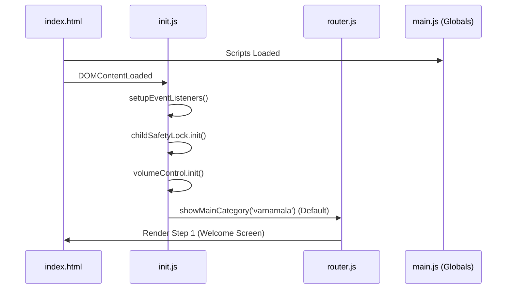

# ⚙️ JAVASCRIPT ARCHITECTURE (v16.3)

- **ID**: `01.03`
- **Version**: `v16.3`
- **Primary Source**: `js/core/`, `js/ui/`, `js/navigation/`
- **Depends On**: `[01.00_PROJECT_INDEX.md]`, `[01.14_GLOBAL_REGISTRY.md]`
- **Keywords**: #JavaScript #Logic #Modules #State #ParentalGate

---

## 🧠 CORE LOGIC MODULES

| Module | Purpose | Key Responsibilities |
|:---|:---|:---|
| `core/main.js` | Globals | Manages high-level state variables. |
| `core/init.js` | Bootloader | Initializes events, volume, and safety locks. |
| `navigation/router.js`| Router | Handles the 5-step overlay transitions. |
| `ui/display.js` | Rendering | Injects HTML cards and SVG icons. |
| `utils/helpers.js` | Utilities | Audio playback, flipping cards, spam guard. |
| `utils/child-safety.js`| Safety | Parental Gate, Browser lockdown, Throttling. |
| `audit/v2.0/rajshree_core.js` | Audit Logic | Frontier Protocol v2.0 console logic. |

---

## 🏗️ BOOTLOADER SEQUENCE (Initialization)

---

## 🛡️ SAFETY & INTERACTION LOCKS
- **Parental Gate**: 3-second hold implemented in `helpers.js`/`init.js`.
- **Spam Guard**: 400ms click threshold in `helpers.js`.
- **Navigation Throttle**: 1s manual skip delay in `child-safety.js`.
- **Playback Lock**: `ChildSafetyLock.lock()` blocks UI during audio.

---

## 🔊 AUDIO ENGINE (`helpers.js`)
- **Method**: `playSound(file, type)`
- **Feature**: 300ms volume fade-in and automatic UI unlocked on `ended`.
- **Sync**: Updates `.progress-bar` in real-time.

---

## 🗂️ DATA INTEGRATION
The system dynamically pulls from 52+ data modules.
- **Registry**: `[01.14_GLOBAL_REGISTRY.md]`
- **Mapping**: `[01.09_PROJECT_AUDIO_MAPPING.md]`

---
#Logic #JavaScript #Programming #Modules #State
