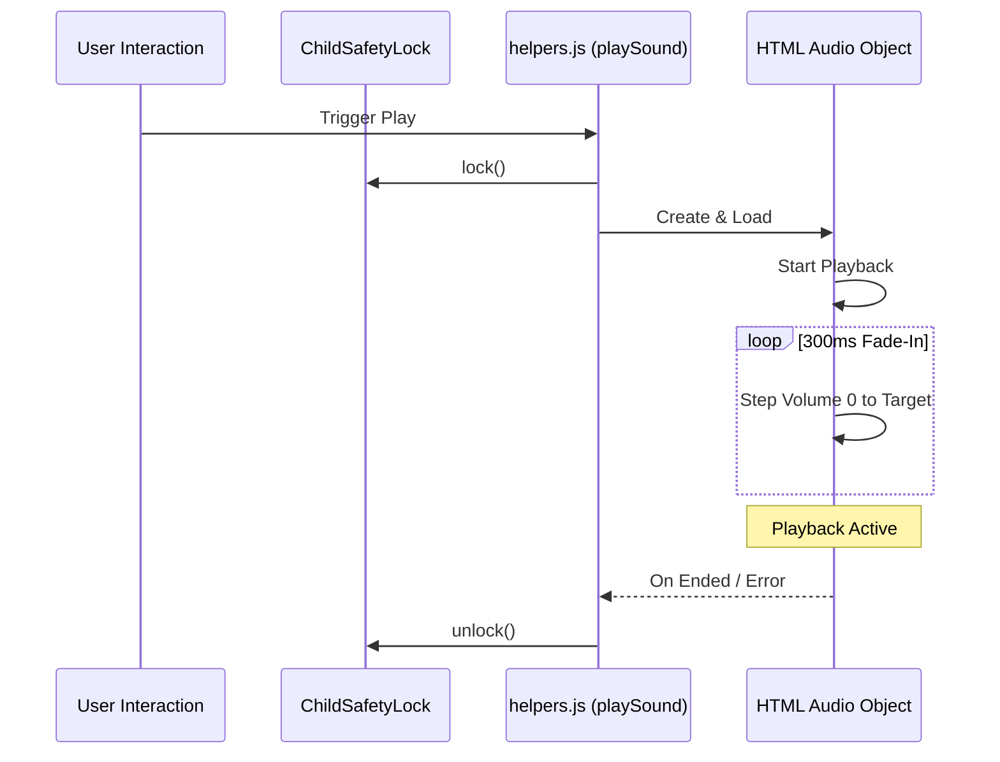

# 🎙️ AUDIO PLAYBACK STANDARDS (v17.2)

- **ID**: `01.07`
- **Version**: `v17.2`
- **Primary Source**: `frontend/src/js/utils/helpers.js`
- **Depends On**: `[01.00_PROJECT_INDEX.md]`, `[01.09_PROJECT_AUDIO_MAPPING.md]`
- **Keywords**: #Audio #Helpers #FadeIn #UIFeedback #v17.2

---

## 🏗️ AUDIO PLAYBACK LIFECYCLE

## 🛠️ CORE METHODOLOGY

### 1. High-Fidelity Injection (`helpers.js`)
- **Fade-In Logic**: To prevent "pops" and protect hearing, volume fades from `0` to `target` over **300ms** (15 steps).
- **Progress Tracking**: `.progress-bar` width is synchronized with the `timeupdate` event.
- **Auto-Unlock**: UI is locked while audio plays; automatically unlocks on `ended` or `error`.
- **Visual Feedback**: `.playing` class is applied to the active card; `.audio-pulse` animation for the volume indicator.

---

## 📂 SYSTEM VOICE MODELS (v17.2)
The application uses AI-generated Neural voices for maximum clarity across all Hindi categories.

| Voice Model | Priority | Technical Tuning | Primary Role/Mode |
|:---|:---|:---|:---|
| `en-IN-NeerjaExpressiveNeural` | **Primary** | Default | **Kids/Fun Mode**: Highly expressive, cartoons-like persona for maximum engagement. |
| `hi-IN-SwaraNeural` | **Secondary** | Rate -5%, Pitch +1Hz | **Formal Learning**: Clear, instructional teacher-like voice for Varnamala/Ganit. |
| `hi-IN-MadhurNeural` | **Parent-Only** | Rate -5%, Pitch +1Hz | **Parent Mode**: Calm, reliable adult-to-adult voice for instructions/settings. |

### 🔄 Mode Logic
- **Learning Mode (Hybrid)**: The application alternates between **Neerja** and **Swara** to keep the child engaged while maintaining instructional clarity.
- **Parental Mode**: Exclusively uses **Madhur** for all system instructions, safety gates, and settings menus.

---

## 📜 SCRIPTING & GENERATION RULES

To ensure high-fidelity audio without technical artifacts, follow these strict rules for TTS generation:

### 1. Script Format by Locale
- **`en-IN` Locale (Neerja)**: 
    - **Rule**: Use **Hinglish (Roman Script)**. 
    - **Reason**: The `en-IN` engine cannot process Devanagari script; sending Hindi characters will cause a "No Audio Received" error.
    - **Example**: `Main hoon Sher` instead of `मैं हूँ शेर`.
- **`hi-IN` Locale (Swara / Madhur)**:
    - **Rule**: Use **Devanagari (Native Hindi Script)**.
    - **Reason**: Native script ensures perfect phoneme pronunciation and natural word stress.

### 2. Elimination of Symbols (The "Asterisk" Rule)
- **CRITICAL**: Never include Markdown formatting (`**bold**`, `*italic*`) or special symbols in the text sent to the TTS engine.
- **Failure**: If symbols are present, the AI will literally speak the words "Asterisk Asterisk," destroying the educational value.
- **Instruction**: Strip all markdown markers before generation. Use clear, unformatted text strings.

### 3. Persona Consistency
- **Neerja**: Scripts should include expressive sound cues (e.g., `Moo!`, `Roar!`, `Vroom!`) and enthusiastic tone markers.
- **Swara**: Scripts should be rhythmic, steady, and focused on clear syllable enunciation.

---
#Audio #Sound #Logic #UIFeedback #TTS #v17.2

