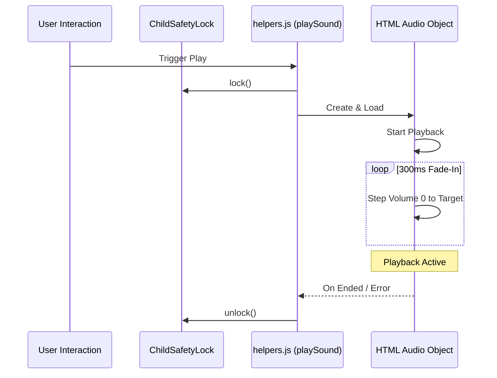

# 🎙️ AUDIO PLAYBACK STANDARDS (v17.2)

- **ID**: `01.07`
- **Version**: `v17.2`
- **Primary Source**: `frontend/src/js/utils/helpers.js`
- **Depends On**: `[01.00_PROJECT_INDEX.md]`, `[01.09_PROJECT_AUDIO_MAPPING.md]`
- **Keywords**: #Audio #Helpers #FadeIn #UIFeedback #v17.2

---

## 🏗️ AUDIO PLAYBACK LIFECYCLE

## 🛠️ CORE METHODOLOGY

### 1. High-Fidelity Injection (`helpers.js`)
- **Fade-In Logic**: To prevent "pops" and protect hearing, volume fades from `0` to `target` over **300ms** (15 steps).
- **Progress Tracking**: `.progress-bar` width is synchronized with the `timeupdate` event.
- **Auto-Unlock**: UI is locked while audio plays; automatically unlocks on `ended` or `error`.
- **Visual Feedback**: `.playing` class is applied to the active card; `.audio-pulse` animation for the volume indicator.

---

## 📂 SYSTEM VOICE MODELS (v17.2)
The application uses AI-generated Neural voices for maximum clarity across all Hindi categories.

| Voice Model | Category | Technical Tuning | Purpose |
|:---|:---|:---|:---|
| `en-IN-NeerjaExpressive` | Primary | Default | Human-like & Emotional feedback. |
| `hi-IN-SwaraNeural` | Secondary | Rate -5%, Pitch +1Hz | Formal instructions & navigation. |
| `hi-IN-MadhurNeural` | Tertiary | Rate +5%, Pitch +2Hz | Energetic learning reinforcement. |

---
#Audio #Sound #Logic #UIFeedback #v17.2

