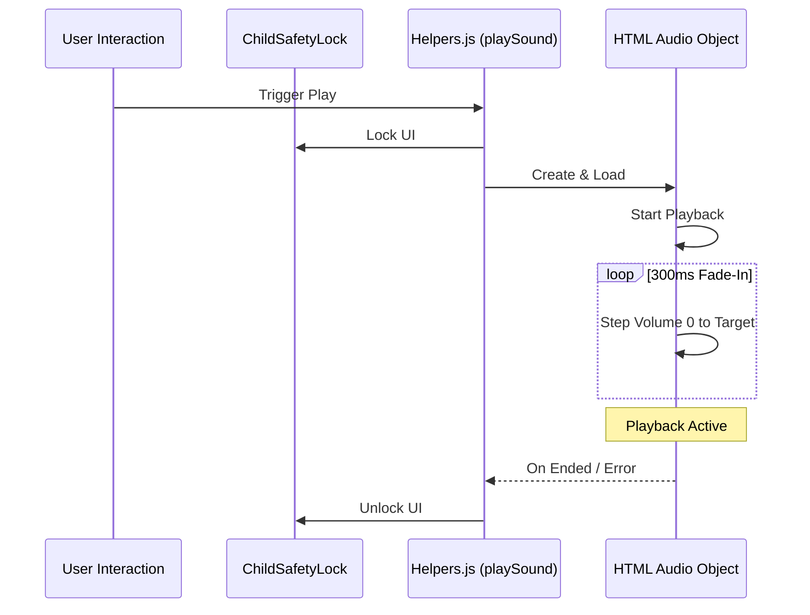

# 🎙️ AUDIO PLAYBACK STANDARDS (v16.3)

- **ID**: `01.07`
- **Version**: `v16.3`
- **Primary Source**: `utils/helpers.js`
- **Depends On**: `[01.00_PROJECT_INDEX.md]`, `[01.09_PROJECT_AUDIO_MAPPING.md]`
- **Keywords**: #Audio #Helpers #FadeIn #UIFeedback #v16.3

---

## 🏗️ AUDIO PLAYBACK LIFECYCLE

## 🛠️ CORE METHODOLOGY

### 1. High-Fidelity Injection (`helpers.js`)
- **Fade-In Logic**: To prevent "pops" and protect hearing, volume fades from `0` to `target` (globalVolume) over **300ms** (15 steps of 20ms).
- **Progress Tracking**: `.progress-bar` width is synchronized with `timeupdate` event.
- **Auto-Unlock**: UI is locked while audio plays; automatically unlocks on `ended` or `error`.
- **Visual Feedback**: `body.audio-active` class added during playback; `card.playing` class for active card.

---

## 📂 SYSTEM ASSETS (Neural Inventory)
| Voice Model | Category | Finalized Settings | Purpose |
|:---|:---|:---|:---|
| `en-IN-NeerjaExpressive` | **Primary (Dynamic)** | Default | Human-like & Emotional |
| `hi-IN-SwaraNeural` | **Secondary (Formal)** | Rate -5%, Pitch +1Hz | Professional & Calm |
| `hi-IN-MadhurNeural` | **Tertiary (Male)** | Rate +5%, Pitch +2Hz | Energetic Response |

---
#Audio #Sound #Logic #UIFeedback
