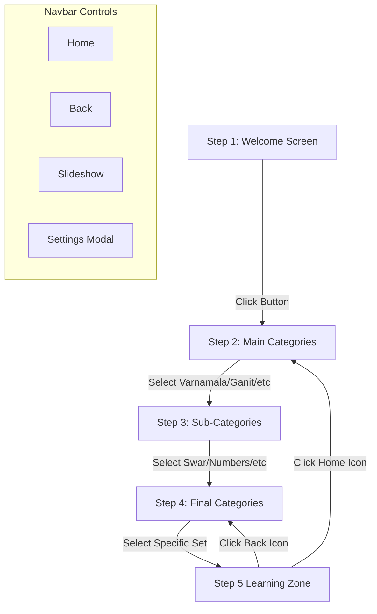
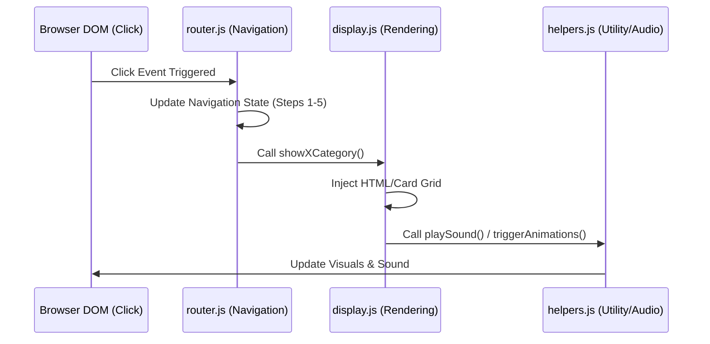

# 🧭 MENU & NAVBAR STRUCTURE (v17.2)

- **ID**: `01.10`
- **Version**: `v17.2`
- **Primary Source**: `frontend/src/js/navigation/router.js`, `frontend/src/js/ui/display.js`
- **Depends On**: `[01.00_PROJECT_INDEX.md]`, `[01.08_PROJECT_ICONS.md]`
- **Keywords**: #Navigation #Router #UIFlow #Navbar #v17.2

---

## 🏗️ NAVIGATION FLOWCHART

---

## 🏗️ EVENT FLOW DIAGRAM (Click-to-Update Cycle)

---

## 🏗️ NAVIGATION HIERARCHY (Steps 1-5)

The application uses a multi-layered overlay system to guide users to their chosen category before entering the Learning Zone.

### Step 1: Welcome (`#step-1`)
- **Action**: User clicks "शुरू करें" (🚀) to enter the app.

### Step 2: Main Categories (`#step-2`)
| Icon | Category | Key | Implementation |
|:---|:---|:---|:---|
| 📖 | वर्णमाला | `varnamala` | Direct to Step 3 |
| 🧮 | गणित | `sankhya` | Direct to Step 3 |
| 🌎 | मेरा संसार | `names` | Direct to Step 3 |
| 🎮 | खेल-कूद | `games` | Direct to Step 3 |

### Step 3: Sub-Categories (`#step-3`)
- **Varnamala**: Swar, Vyanjan, Samyukt, Matra. (All go to Learning Zone)
- **Sankhya**: Ginti (`numbers_main`), Pahade (`tables_main`), Shapes (`shapes_fun`).
- **Names**: Family & Body, Animals & Birds, Food & Drinks, Around Us, Nature & Time, Colors & Fun.

### Step 4: Final Categories (`#step-4`)
- **Ginti**: 1-10, 1-100.
- **Pahade**: Method 1, Method 2.
- **Around Us**: Objects, Clothes, Toys, Vehicles, Places, Helpers.
- **Colors & Fun**: **Colors World** (Goes to Step 5), Instruments, etc.

### Step 5: Deepest Categories (`#step-5`)
- **Colors World**: Pink/Red, Blue/Green, Brown/Beige, Metallic, Special.

---

## 🔒 SPECIAL DOMAIN: MODULAR SETTINGS (v17.2)
The Settings interface is now a standalone module accessed via the Cog icon in the Navbar:
- **Iframe Integration**: Loads `settings.html` within a modal overlay.
- **Real-time Sync**: Uses `postMessage` for immediate configuration updates (Volume, Theme, Voice).
- **Domain Focus**: Specialized views for Kids, Parents, Admins, and Developers.

---

## 📱 NAVBAR BEHAVIOR
- **Home (🏠)**: Instantly resets `window.currentIndex` and returns to Step 2.
- **Active State**: The currently selected icon in the Navbar is highlighted with `.active-menu-icon`.
- **Dynamic Icons**: As the user navigates deeper, the Navbar icon updates to match the current selection (e.g., 📖 → अ → 🍎).
- **Glassmorphism**: The navbar uses `-webkit-backdrop-filter: blur(20px)` for a modern, premium feel.

---
#Navigation #UI #Router #Menu #Navbar #v17.2

