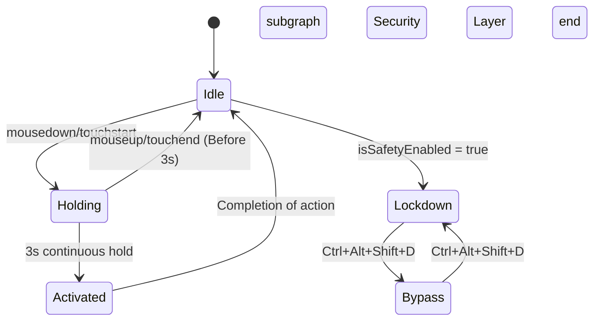

# 🛡️ CHILD SAFETY FEATURES (v17.2)

- **ID**: `01.12`
- **Version**: `v17.2`
- **Primary Source**: `frontend/src/js/utils/child-safety.js`
- **Depends On**: `[01.00_PROJECT_INDEX.md]`, `[01.14_GLOBAL_REGISTRY.md]`
- **Keywords**: #Safety #Locks #ParentalGate #Security #v17.2

---

## 🏗️ PARENTAL GATE STATE MACHINE

## 🏗️ OVERVIEW
Child safety is the project's highest priority. The system is designed to prevent children from accidentally changing settings or exiting the app. All safety logic is centralized in `child-safety.js` and synchronized with the frontend via `helpers.js`.

---

## 🛂 THE PARENTAL GATE (Time-Locked Actions)
To prevent accidental access to critical menus, specific buttons require a **3-second continuous hold** to activate.

| Feature | Trigger ID | Logic |
|:---|:---|:---|
| **Project Settings** | `#nav-settings` | 3-second hold required for entry. |
| **Stop Slideshow** | `#nav-slideshow` | 3-second hold required while active. |
| **Internal Panels** | `settings.html` | Modular panels (Admin/Dev) require additional verification. |

- **Visual Feedback**: The system sets a CSS variable `--hold-progress` (0 to 100%) on the element.
- **Auto-Bypass**: If `isSafetyEnabled` is `false`, the gate is bypassed for one-click access.

---

## 🛠️ INTERACTION CONTROLS (Anti-Spam)
The `ChildSafetyLock` object manages UI locking to ensure stability.

### 1. Click Spam Guard
- **Threshold**: **400ms**.
- **Action**: Rapid clicks are ignored to prevent UI flickering.

### 2. Navigation Throttle
- **Threshold**: **1000ms** (1 second).
- **Action**: In Kids Mode, manual card skipping is throttled to once per second.

### 3. Playback Locking
- **Lock**: UI is locked automatically via `ChildSafetyLock.lock()` when audio begins.
- **Unlock**: UI is released via `ChildSafetyLock.unlock()` when audio ends or fails.

---

## 💻 BROWSER LOCKDOWN (Safety Mode)
When Safety Mode is enabled, the browser is restricted to a "Kids Kiosk" environment via `child-safety.js`.

### 1. Keyboard & Input Blocks
- **Right-Click**: Disabled (`contextmenu`).
- **Dev Tools**: Blocks `F12`, `Ctrl+Shift+I`, `Ctrl+Shift+J`, `Ctrl+Shift+C`.
- **System**: Blocks Page Source (`Ctrl+U`), Save (`Ctrl+S`), Print (`Ctrl+P`).
- **Input**: Disables text selection across the entire application body.

### 2. Zoom & Pinch Prevention
- **Scroll Zoom**: Blocks `Ctrl + Wheel`.
- **Keyboard Zoom**: Blocks `Ctrl + (- / + / 0)`.
- **Mobile Zoom**: Blocks pinch-to-zoom and double-tap interactions.

---

## 🔑 DEVELOPER ACCESS & BYPASS

### 1. The Master Bypass Code
- **Shortcut**: **`Ctrl + Alt + Shift + D`**
- **Action**: Toggles the global `isSafetyEnabled` state.

### 2. URL Parameters
- Adding **`?dev=true`** to the URL disables safety features on load for debugging.

---
#Safety #Lock #Security #ParentalGate #SpamGuard #v17.2

