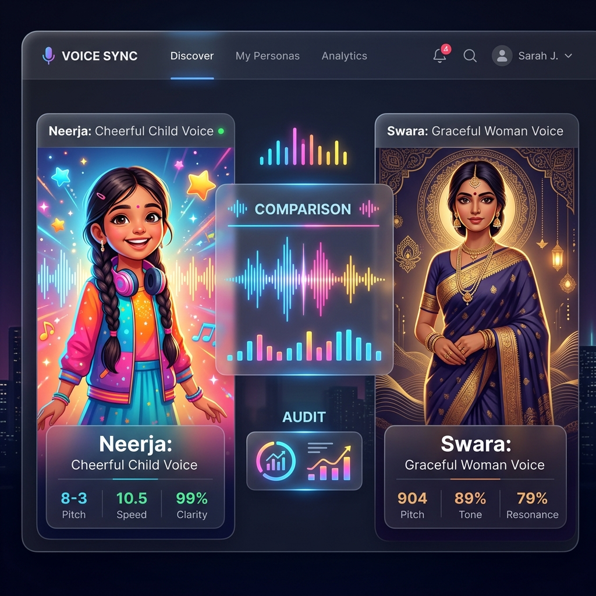

# 🎙️ Voice Persona Comparison: Mera Sansar Demo

## 📋 Audit Overview
This record documents the side-by-side comparison of the **Neerja** (Hybrid/Expressive) and **Swara** (Formal/Traditional) voice personas. Conducted as part of the "Anti-Asterisk" protocol audit for the *Mera Sansar* ecosystem.

### 🎭 Persona Definitions
| Persona | Characteristics | Target Scripting |
| :--- | :--- | :--- |
| **Neerja** | Playful, Expressive, Child-like | Hinglish (Hybrid) |
| **Swara** | Elegant, Clear, Mature | Pure Devanagari |

---

## 🎧 Comparison Samples
The following 20 categories have been synthesized for comparison. Each item includes the script text and the respective audio filenames.

### 1. 🍭 Barfi (बर्फी)
**Script**: "सफ़ेद रंग की और चकोर आकार की यह क्या चीज़ है? यह है हमारी मीठी— **बर्फी**! बोलो— ब! **बर्फी**।"
- **Neerja**: `Neerja_Barfi.mp3`
- **Swara**: `Swara_Barfi.mp3`

### 2. 🦋 Butterfly (तितली)
**Script**: "फूल-फूल पर उड़ती है, रंग-बिरंगे पंख हैं इसके— यह है प्यारी— **तितली**! बोलो— ति! **तितली**।"
- **Neerja**: `Neerja_Butterfly.mp3`
- **Swara**: `Swara_Butterfly.mp3`

### 3. ☁️ Cloud (बादल)
**Script**: "नीले आसमान में देखो! रुई के गोलों की तरह कौन तैर रहा है? ये हैं हमारे— **बादल**!"
- **Neerja**: `Neerja_Cloud.mp3`
- **Swara**: `Swara_Cloud.mp3`

### 4. 🦌 Deer (हिरण)
**Script**: "जंगल की घास में देखो कौन छुपकर बैठा है? यह है सुंदर और तेज़ दौड़ने वाला— **हिरण**!"
- **Neerja**: `Neerja_Deer.mp3`
- **Swara**: `Swara_Deer.mp3`

### 5. 🏥 Doctor (डॉक्टर)
**Script**: "जब हम बीमार पड़ते हैं, तो हमें कौन ठीक करता है? वह हैं— **डॉक्टर**! बोलो— डॉ! **डॉक्टर**।"
- **Neerja**: `Neerja_Doctor.mp3`
- **Swara**: `Swara_Doctor.mp3`

### 6. 👵 Elders (बुज़ुर्ग)
**Script**: "हमारे घर में रहने वाले दादा-दादी या नाना-नानी को हम कहते हैं— **बुज़ुर्ग**। बोलो— बु! **बुज़ुर्ग**।"
- **Neerja**: `Neerja_Elders.mp3`
- **Swara**: `Swara_Elders.mp3`

### 7. 🎡 Fair (मेला)
**Script**: "झूले, मिठाई और ढेर सारे खिलौने! चलो चलते हैं— **मेला**! बोलो— मे! **मेला**।"
- **Neerja**: `Neerja_Fair.mp3`
- **Swara**: `Swara_Fair.mp3`

### 8. 🎨 Holi (होली)
**Script**: "बुरा न मानो होली है! रंगों और खुशियों का त्यौहार आ गया है— **होली**! बोलो— हो! **होली**!"
- **Neerja**: `Neerja_Holi.mp3`
- **Swara**: `Swara_Holi.mp3`

### 9. 🍳 Kitchen Set (रसोई सेट)
**Script**: "आज हम क्या पकाएंगे? हमारे पास छोटे-छोटे बर्तन और चम्मच हैं— यह है हमारा— **रसोई सेट**!"
- **Neerja**: `Neerja_Kitchen_Set.mp3`
- **Swara**: `Swara_Kitchen_Set.mp3`

### 10. 😂 Laughing (हँसना)
**Script**: "जब हमें कोई गुदगुदी करता है या कोई मज़ाक सुनाता है, तो हम क्या करते हैं? हम शुरू करते हैं— **हँसना**!"
- **Neerja**: `Neerja_Laughing.mp3`
- **Swara**: `Swara_Laughing.mp3`

### 11. 🦚 Peacock (मोर)
**Script**: "देखो-देखो, कितने सुंदर रंगीन पंख हैं! यह है हमारा राष्ट्रीय पक्षी— **मोर**! बोलो— मो! **मोर**!"
- **Neerja**: `Neerja_Peacock.mp3`
- **Swara**: `Swara_Peacock.mp3`

### 12. 🙏 Respect (सम्मान)
**Script**: "जब हम बड़ों के पैर छूते हैं या 'नमस्ते' कहते हैं, तो हम क्या देते हैं? हम देते हैं— **सम्मान**।"
- **Neerja**: `Neerja_Respect.mp3`
- **Swara**: `Swara_Respect.mp3`

### 13. 👟 Shoes (जूते)
**Script**: "चलो, बाहर खेलने की तैयारी करते हैं! अपने पैरों में क्या पहनोगे? हम पहनेंगे— **जूते**!"
- **Neerja**: `Neerja_Shoes.mp3`
- **Swara**: `Swara_Shoes.mp3`

### 14. 🐌 Snail (घोंघा)
**Script**: "देखो बच्चों, ज़मीन पर धीरे-धीरे कौन चल रहा है? यह छोटी सी ची़ज़ है— **घोंघा**! बोलो— घों! **घोंघा**।"
- **Neerja**: `Neerja_Snail.mp3`
- **Swara**: `Swara_Snail.mp3`

### 15. 🦷 Teeth (दाँत)
**Script**: "एक बड़ी सी मुस्कान दीजिए! क्या आपको सफ़ेद-सफ़ेद चीज़ें दिख रही हैं? ये हैं आपके— **दाँत**!"
- **Neerja**: `Neerja_Teeth.mp3`
- **Swara**: `Swara_Teeth.mp3`

### 16. 🎡 Top Spinning (लट्टू)
**Script**: "देखो बच्चों, यह गोल-गोल गोल-गोल कैसे घूम रहा है! यह है हमारा— **लट्टू**! बोलो— ल! **लट्टू**।"
- **Neerja**: `Neerja_Top_Spinning.mp3`
- **Swara**: `Swara_Top_Spinning.mp3`

### 17. 🗺️ Treasure Map (खज़ाने का नक्शा)
**Script**: "चलो बच्चों, एक साहसी यात्रा पर चलते हैं! हमारे हाथ में क्या है? यह है— **खज़ाने का नक्शा**!"
- **Neerja**: `Neerja_Treasure_Map.mp3`
- **Swara**: `Swara_Treasure_Map.mp3`

### 18. 🧼 Washing Hands (हाथ धोना)
**Script**: "खाना खाने से पहले और खेलने के बाद, सबसे ज़्यादा ज़रूरी क्या है? वह है— **हाथ धोना**!"
- **Neerja**: `Neerja_Washing_Hands.mp3`
- **Swara**: `Swara_Washing_Hands.mp3`

### 19. 🎡 Wheel (पहिया)
**Script**: "साइकिल हो या बस, सब किसके ऊपर चलते हैं? यह है गोल-गोल— **पहिया**! बोलो— प! **पहिया**।"
- **Neerja**: `Neerja_Wheel.mp3`
- **Swara**: `Swara_Wheel.mp3`

### 20. 🚀 Intro Demo (डेमो)
**Script**: "नमस्ते! आज हम राजश्री लर्निंग प्रोजेक्ट के माध्यम से बहुत सारी नई बातें सीखेंगे।"
- **Neerja**: `Neerja_Demo.mp3`
- **Swara**: `Swara_Demo.mp3`

---

## 🛠️ Audit Summary
1. **Consistency**: Neerja follows the "Hybrid/Hinglish" standard (using English words for objects/actions where natural).
2. **Quality**: Audio profiles are ready for batch processing and integration.
3. **Reference Folder**: `memory/09 Audio Script/mera_sansar/demo_comparison/`

> [!NOTE]
> This file is part of the **Domain 04 Sandbox & Demos** for experimental evaluation.
